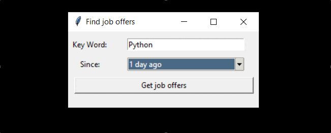

# Interval Learning Flashcards


> A Python application for [space repetition](https://en.wikipedia.org/wiki/Spaced_repetition)
> that asks you 2 random questions per day
> 
> Based on the Leitner system, newly introduced and more difficult questions are shown more frequently,
> while older and less difficult ones are shown less frequently in 
> order to exploit the psychological spacing effect.

## Installation (Windows)
git clone the project, then install package requirements:
Using terminal:
```
py -m pip install -r requirements.txt
```

## Setings
Before using the app, you have to create the database and feed it with your questions
#### 1. create database
Using terminal (at project root):
```shell
mkdir data
py -m flashcards.update_database create
```
#### 2. feed database with questions
* First, you have to fill your questions in an Excel file, with this structure:

/!\ 'Imported' column has to be empty.
After the import, the program will fill the cell with "OK".

* Then, using terminal (at project root):
```shell
py -m flashcards.update_database update *Excel_file.xlsx*

```
Note: If you need to import new questions in the database, just add it to
the Excel file and execute the same command.

## Usage
A good to use this app is to set a daily task on Windows with[Task Scheduler](https://www.windowscentral.com/how-create-automated-task-using-task-scheduler-windows-10),
with action like: 


## Release History
* 0.0.1
    * First realease

## Meta

LABESSE Maxence - maxence.labesse@yahoo.fr

Distributed under the MIT license. See ``LICENSE`` for more information.

[https://github.com/Maxence-Labesse/Flashcard-Interval-Learning]()